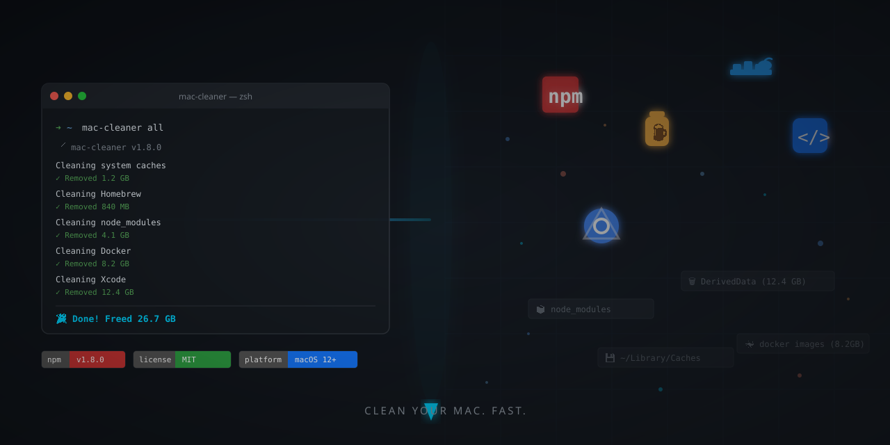

# mac-cleaner

A fast, safe CLI for cleaning macOS development caches. Reclaim gigabytes of disk space from npm, Homebrew, Docker, Xcode, browsers, and more — in seconds.



[**▶ Watch demo (75s)**](https://github.com/BlackAsteroid/mac-cleaner-cli/releases/download/v1.5.5/demo.mp4)

[](https://www.npmjs.com/package/@blackasteroid/mac-cleaner-cli)
[](https://github.com/BlackAsteroid/mac-cleaner-cli/actions)
[](LICENSE)

---

## Why

Development machines accumulate gigabytes of cached files over time: npm packages, Homebrew formulas, Docker images, Xcode derived data. Finding and cleaning these manually is tedious and easy to forget.

`mac-cleaner` does it in one command.

```bash
mac-cleaner all
```

---

## Install

```bash
npm install -g @blackasteroid/mac-cleaner-cli
```

Requires **Node.js 20+** and **macOS**.

---

## Quick start

```bash
mac-cleaner all --dry-run    # See what would be cleaned (safe preview)
mac-cleaner all              # Clean everything
mac-cleaner system           # Just system caches and logs
mac-cleaner node --verbose   # Clean npm/yarn/pnpm with details
```

---

## Commands

| Command      | What it cleans |
|--------------|----------------|
| `all`        | Everything at once — safe defaults |
| `system`     | System logs, temp files & caches |
| `brew`       | Homebrew cache & old package versions |
| `node`       | npm/yarn/pnpm caches + orphaned `node_modules` |
| `browser`    | Chrome, Firefox, Safari, Arc, Brave caches |
| `docker`     | Unused containers, images, volumes, build cache |
| `xcode`      | Derived data, device support files, simulators |
| `keychain`   | Stale Keychain entry audit (read-only) |
| `privacy`    | Recent files lists, Finder recents |
| `scan`       | Detect accidentally exposed secrets in caches |
| `upgrade`    | Update mac-cleaner to the latest version |

---

## Common flags

| Flag                | What it does |
|---------------------|--------------|
| `--dry-run`         | Show what would be deleted — nothing is touched |
| `--verbose` / `-v`  | Show each file/folder as it's processed |
| `--json`            | Machine-readable JSON output (great for scripts) |
| `--no-sudo`         | Skip paths that require elevated permissions |
| `-y` / `--yes`      | Non-interactive mode (CI/scripts) |
| `--secure-delete`   | Overwrite files before deletion (slower, more thorough) |
| `--include-orphans` | Also remove orphaned `node_modules` (use carefully in monorepos) |

---

## Examples

```bash
# Preview a full cleanup without deleting anything
mac-cleaner all --dry-run

# Clean everything and pipe results to a log
mac-cleaner all --json | tee cleanup.log | jq .

# Clean node caches and show details
mac-cleaner node --verbose

# Scan for accidentally exposed secrets (API keys, tokens) before cleaning
mac-cleaner scan

# Update mac-cleaner itself
mac-cleaner upgrade
```

---

## Security

- All shell commands use `spawnSync` with explicit argument arrays — no shell injection.
- Sudo password collected via masked terminal input, passed via stdin, never stored or logged.
- Symlink escape protection on all file deletions.
- Strict semver validation before `npm install` calls.
- See [SECURITY.md](SECURITY.md) for the full security policy.

---

## Contributing

Pull requests are welcome. See [CONTRIBUTING.md](CONTRIBUTING.md) for guidelines.

Found a bug? [Open an issue](https://github.com/BlackAsteroid/mac-cleaner-cli/issues/new/choose).

---

## License

MIT — see [LICENSE](LICENSE).

---

Made with ☕ by [BlackAsteroid](https://github.com/BlackAsteroid).
