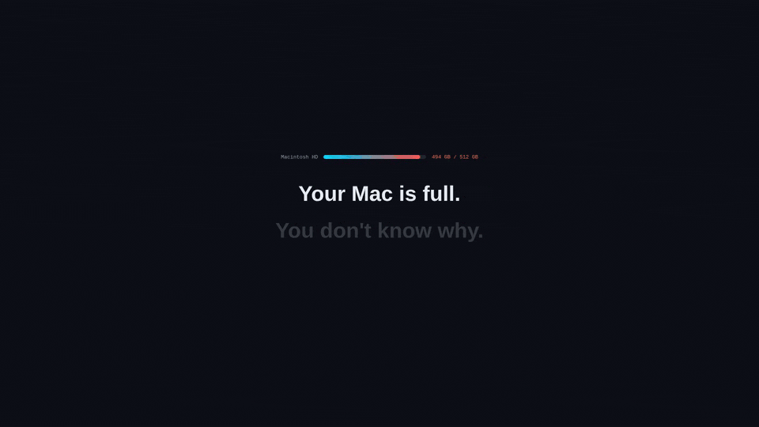

# mac-cleaner

A fast, safe CLI for cleaning macOS development caches. Reclaim gigabytes of disk space from npm, Homebrew, Docker, Xcode, browsers, and more — in seconds.

[](https://github.com/pablofmorales/mac-cleaner-cli/releases/download/v1.5.5/demo.mp4)


[](https://www.npmjs.com/package/@blackasteroid/mac-cleaner-cli)
[](https://github.com/pablofmorales/homebrew-tap)
[](https://github.com/pablofmorales/mac-cleaner-cli/actions)
[](LICENSE)

---

## Why

Development machines accumulate gigabytes of cached files over time: npm packages, Homebrew formulas, Docker images, Xcode derived data. Finding and cleaning these manually is tedious and easy to forget.

`mac-cleaner` does it in one command.

```bash
mac-cleaner all
```

---

## Install

### Homebrew (recommended)

```bash
brew install pablofmorales/tap/mac-cleaner
```

This taps the [pablofmorales/tap](https://github.com/pablofmorales/homebrew-tap) and installs `mac-cleaner` with all dependencies managed automatically.

### npm

```bash
npm install -g @blackasteroid/mac-cleaner-cli
```

Requires **Node.js 20+** and **macOS**.

---

## Quick start

```bash
mac-cleaner cleanup all --dry-run    # See what would be cleaned (safe preview)
mac-cleaner cleanup all              # Clean everything
mac-cleaner cleanup system           # Just system caches and logs
mac-cleaner cleanup node --verbose   # Clean npm/yarn/pnpm with details
mac-cleaner speed maintain           # DNS flush, Spotlight rebuild, etc.
mac-cleaner protection scan          # Check for leaked secrets
```

---

## Commands

Commands are organized into groups by utility:

### Cleanup -- free disk space

| Command                    | What it cleans |
|----------------------------|----------------|
| `cleanup all`              | Everything at once -- safe defaults |
| `cleanup system`           | System logs, temp files & caches |
| `cleanup brew`             | Homebrew cache & old package versions |
| `cleanup node`             | npm/yarn/pnpm caches + orphaned `node_modules` |
| `cleanup browser`          | Chrome, Firefox, Safari, Arc, Brave caches |
| `cleanup docker`           | Unused containers, images, volumes, build cache |
| `cleanup xcode`            | Derived data, device support files, simulators |
| `cleanup cloud`            | Cloud storage caches (iCloud, Dropbox, etc.) |
| `cleanup mail`             | Cached mail attachments and downloads |
| `cleanup mobile-backups`   | Old iOS/iPadOS device backups |

### Protection -- security & privacy

| Command                | What it does |
|------------------------|--------------|
| `protection privacy`  | Clear recent files lists, Finder recents |
| `protection keychain`  | Audit stale Keychain entries (read-only) |
| `protection scan`      | Detect accidentally exposed secrets in caches |

### Speed -- performance tuning

| Command            | What it does |
|--------------------|--------------|
| `speed maintain`   | DNS flush, Spotlight rebuild, purge RAM, font caches |
| `speed startup`    | List and inspect Launch Agents (read-only) |

### Applications

| Command              | What it does |
|----------------------|--------------|
| `applications apps`  | Find & remove leftover files from uninstalled apps |

### Files -- discovery & management

| Command              | What it does |
|----------------------|--------------|
| `files large-files`  | Find and remove large & old files |
| `files duplicates`   | Find and remove duplicate files |
| `files disk-usage`   | Visual disk usage breakdown (Space Lens) |

### Other

| Command    | What it does |
|------------|--------------|
| `upgrade`  | Update mac-cleaner to the latest version |
| `status`   | Show system health overview |

---

## Common flags

| Flag                | What it does |
|---------------------|--------------|
| `--dry-run`         | Show what would be deleted — nothing is touched |
| `--verbose` / `-v`  | Show each file/folder as it's processed |
| `--json`            | Machine-readable JSON output (great for scripts) |
| `--no-sudo`         | Skip paths that require elevated permissions |
| `-y` / `--yes`      | Non-interactive mode (CI/scripts) |
| `--secure-delete`   | Overwrite files before deletion (slower, more thorough) |
| `--include-orphans` | Also remove orphaned `node_modules` (use carefully in monorepos) |

---

## Examples

```bash
# Preview a full cleanup without deleting anything
mac-cleaner cleanup all --dry-run

# Clean everything and pipe results to a log
mac-cleaner cleanup all --json | tee cleanup.log | jq .

# Clean node caches and show details
mac-cleaner cleanup node --verbose

# Scan for accidentally exposed secrets (API keys, tokens)
mac-cleaner protection scan

# Run maintenance tasks (DNS flush, Spotlight rebuild)
mac-cleaner speed maintain

# Update mac-cleaner itself
mac-cleaner upgrade
```

---

## Migrating from flat commands

Previous flat commands (`mac-cleaner system`, `mac-cleaner clean system`) still work but show a deprecation warning. Update your scripts to use the new grouped syntax:

| Old command               | New command                  |
|---------------------------|------------------------------|
| `mac-cleaner system`      | `mac-cleaner cleanup system` |
| `mac-cleaner clean brew`  | `mac-cleaner cleanup brew`   |
| `mac-cleaner scan`        | `mac-cleaner protection scan`|
| `mac-cleaner disk-usage`  | `mac-cleaner files disk-usage`|

Set `MAC_CLEANER_NO_DEPRECATION=1` to suppress warnings.

---

## Security

- All shell commands use `spawnSync` with explicit argument arrays — no shell injection.
- Sudo password collected via masked terminal input, passed via stdin, never stored or logged.
- Symlink escape protection on all file deletions.
- Strict semver validation before `npm install` calls.
- See [SECURITY.md](SECURITY.md) for the full security policy.

---

## Contributing

Pull requests are welcome. See [CONTRIBUTING.md](CONTRIBUTING.md) for guidelines.

Found a bug? [Open an issue](https://github.com/pablofmorales/mac-cleaner-cli/issues/new/choose).

---

## License

MIT — see [LICENSE](LICENSE).

---

Made with ☕ by [pablofmorales](https://github.com/pablofmorales).
